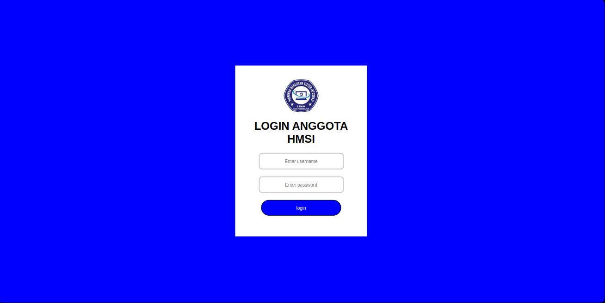

# login-html

Pertemuan 1: HTML & CSS DASAR. Membuat login system dengan html, css dan JavaScript sebagai validasi.

<table>
  <th><h3>🛠️ Alur Materi</h3></th>
  <tr>
    <td>
      <ul>
        <li>Pembuatan login page pada index.html</li>
        <li>Pembuatan login-style.css</li>
        <li>Pembuatan simple homepage.html</li>
        <li>Pembuatan validasi dengan javascript</li>
      </ul>
    </td>
  </tr>
</table>

## 📋 Previews

Berikut output dari website tersebut:

  
  

## ✨ About Us

- 📫 How to reach us **<unipihmsi@gmail.com>**
